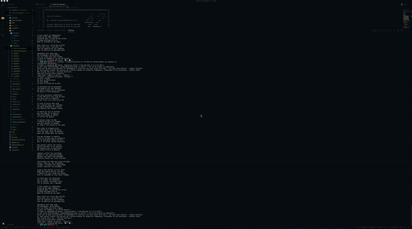

                                                      # Corewar #
Corewar
This project involves creating a virtual arena, and having simplistic-language programs fight each other.
You will thus get acquainted with VM conception (with instructions it recognizes, registers, etc) and compilation problems of an assembly language in bytecode. In bonus, the pleasure to have your champions fight in the arena.

# Objectives
- Compilation
- Machine virtuelle simpliste
- Langage type assembleur simpliste
- Rendu visuel

# Skills
- Adaptation & creativity
- Organization
- Algorithms & AI
- Group & interpersonal

Further information, please give a look to :
- https://github.com/EndlessBox/Corewar/blob/master/corewar.en.pdf.

# Visualitation

Enjoy.
